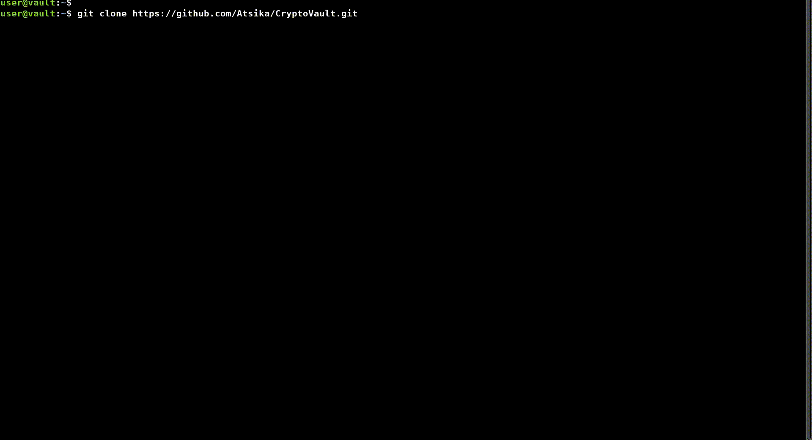
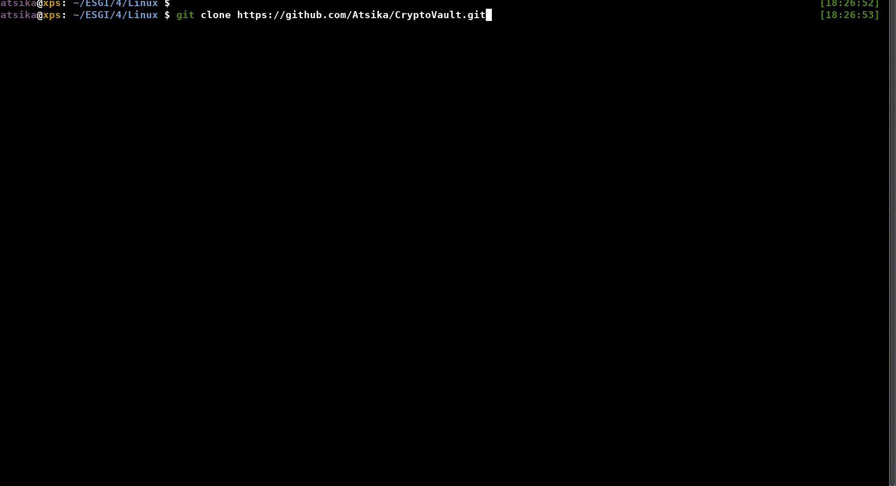

# CryptoVault - Encrypted remote vault

<p align="center">
        <br>

 </p>

### Description

CryptoVault is a remote encrypted vault for securely storing your files. 

## Features

* Automatic installation ⚙️
* AES-256-XTS encryption
* Chroot
* Protection against bruteforce 👊
* Alert by mail 📧
* Use of blacklist 🏴
* All-in-one client script 1️⃣
* Pure bash 💯

## Installation

### Server

```bash
git clone https://github.com/Atsika/CryptoVault.git
cd CryptoVault
chmod +x cv_server.sh
```

### Client

```bash
git clone https://github.com/Atsika/CryptoVault.git
cd CryptoVault
chmod +x cv_client.sh
```

## Usage

There are 2 ways to use scripts for CryptoVault :
* Define variables at the top of the script
* Enter the values when the script asks for it

> 💡 If variables are not defined, the script will automatically request them at runtime.  
> Variables with the same name in the client and server script (in bold below) must have the same value.  
> It is recommended not to modify the variables in the 'CONSTANTS' section.

⚠️ The server script must be run with a user who has the **sudo rights** but is **not root**.  

### Variables

| Name | Description | Example | Script |
|------------|-----------------------------------------------------------------------|--------------|---------------|
| PARTITON | Name of the partition on which the vault will be installed | /dev/sda1 | server |
| SIZE | Vault size in megabytes (MB) | 200 | server |
| VAULT_USER | Name of the new user created especially for vault management | vault | server/client
| SSH_KEY | Name of the SSH keys generated for the VAULT_USER | vault_key | server/client |
SSH_PORT | Port the SSH service should listen on | 7222 | server/client | 7222 | server/client | 7223 | SSH_PORT
| SSH_HOST | Host that hosts the vault | 192.168.1.10 | client |
| SSH_USER | Name of the user who executed the server script | admin | client |

> 💡 It is recommended to change the SSH port for security reasons.

### Execution

#### Server

`./cv_server.sh` &rarr; Installs and configures the server.

<p align="center"></p>

#### Client

`./cv_client.sh init` &rarr; Initiates the first connection to the vault.  
`./cv_client.sh mount` &rarr; Decrypts and mount the vault in $HOME/COFFRE.  
`./cv_client.sh mount` &rarr; Unmounts the vault and encrypts it.

<p align="center"></p>

## Functioning

### Server

* Installation of the necessary packages  
* Configuration of the SMTP server (Postfix) for sending alerts  
* Creation of the user dedicated to the vault and assignment of rights (sudo)  
* Configuration of access authenticated by SSH key  
* Creation of the physical volume  
* Creation of the volume group  
* Creation and encryption of the logical volume  
* Formatting of the encrypted logical volume  
* Chroot vault dedicated user 
* Securing the SSH service  
* Creation of the safe structure  
* Deployment of configuration files  
* Restart of services affected by the script

### Client

#### init

* Installation of the necessary packages 
* SSH private key recovery
* SSH host configuration
* Creation of symbolic link (cheat)

#### mount

* Decrypting vault
* Mounting vault in $HOME/COFFRE

#### umount

* Unmoun vault
* Encrypt vault

<p align="center">Made with ❤️ by Atsika & Léco</p>
